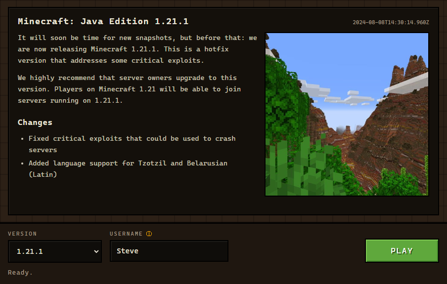

<div align="center">

# MC Launch

A small Minecraft launcher that just gets you into the game. Pick a version, type
a name, hit **Play** — it downloads the game files and the right version of Java
for you, so there's nothing to install first.




</div>

## Download

1. Grab the latest installer from the [**Releases**](../../releases) page
   (`MC Launch Setup x.y.z.msi` on Windows).
2. Run it and follow the installer.
3. Open **MC Launch**, pick a version and a name, hit **Play**. It downloads
   everything it needs — the game *and* Java — and starts Minecraft.

That's it. No Java, no setup, nothing else to install first.

> The installer isn't code-signed yet, so Windows SmartScreen may show a
> "unknown publisher" warning — click **More info → Run anyway**.

It runs in **offline mode**: you can play singleplayer under any name. Joining
official online servers or Realms needs a Microsoft login, which isn't wired up
yet (the code has a clean seam for it).

## How it works

It's the same pipeline every launcher runs: fetch Mojang's version manifest,
read the chosen version's metadata, download the client jar + libraries + assets
(each one checked against its SHA1), make sure a matching Java runtime is
present, then build the `java …` command and spawn it. Files go into the usual
`.minecraft` folder so they're shared with the official launcher.

The auto-Java part is the interesting bit: the launcher reads which Java version
the game needs, pulls the matching runtime straight from Mojang, and points the
launch at that — so the player never installs Java themselves.

It's an Electron app. The main process is the "backend" — it owns all the
downloads, file I/O, and process launching. The React UI is a separate renderer
that can't touch the filesystem; it only calls the few methods exposed on
`window.mcl` over IPC.

## Build from source

```
npm install
npm run dev          # run it with hot reload
npm run dist         # build an installer into release/
```

`npm run dist` produces an `.msi` on Windows, a `.dmg` on macOS, and an AppImage
on Linux — each has to be built on its own OS.

> On Windows the first `npm run dist` can fail while unpacking `winCodeSign`
> with *"A required privilege is not held by the client"* — that's it trying to
> create macOS symlinks, which Windows won't do without permission. Turn on
> **Developer Mode** (Settings → Privacy & security → For developers) or run the
> terminal as administrator, then it builds fine.

There's also a CLI if you'd rather skip the window:

```
npm run launch -- --version 1.21.1 --username Steve
npm run launch -- --prepare-only   # download + verify, don't launch
```

## Where the code lives

```
src/
  core/      the launcher itself: manifest → downloads → java runtime → prepare
  net/       fetch wrapper, sha1-verified downloads, a small concurrency pool
  launch/    classpath, the java argument builder, spawning the process
  auth/      offline auth (and the seam a Microsoft provider would drop into)
  config/    .minecraft paths + os/arch detection
  types/     the shapes of Mojang's manifests
  main/      Electron main process + IPC handlers
  preload/   the contextBridge that exposes window.mcl
  renderer/  the React UI
  cli/       terminal entry point (same core, no window)
  shared/    the IPC contract both sides import
```

## Status

Works end to end on Windows, Linux and macOS: downloads and verifies everything,
fetches Java on its own, shows the version's release notes, and remembers your
last name and version. No Java required on the machine.

Not there yet: real Microsoft login (singleplayer only for now) and mod loaders.
